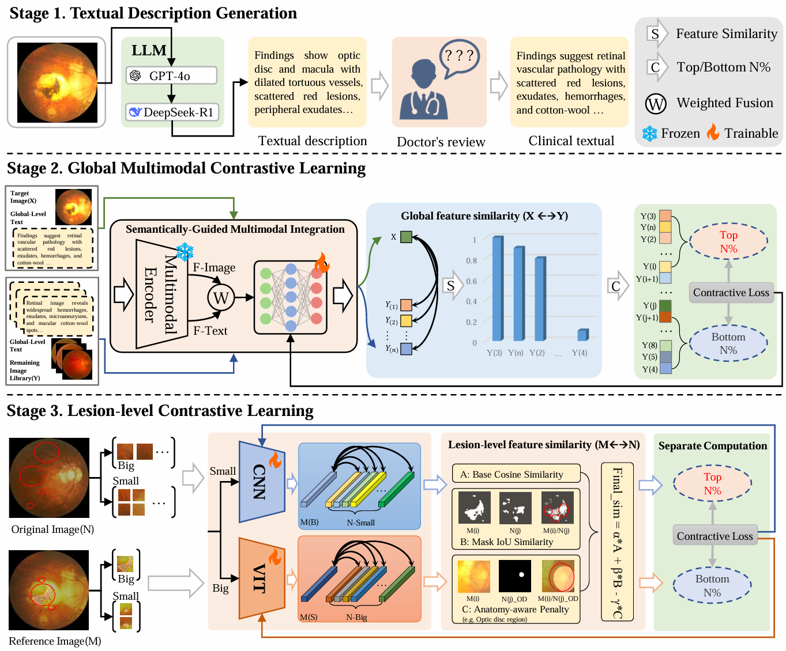
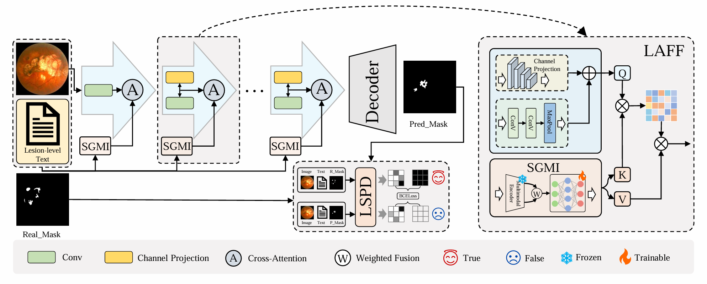

## G2L-SimR: Global-to-Local Similarity-Ranked Contrastive Learning for Retinal Lesion Segmentation




## Table of Contents
- [Install environment](#install-environment)
- [Data preparation](#data-preparation)
- [Requirements](#requirements)
- [Usage](#Usage)

### 🔧Install environment
1. Create environment with conda:
```
conda create -n GLS_env python=3.8.0 -y
conda activate GLS_env
```

2. Install dependencies
```
conda install pytorch==2.3.1 torchvision==0.18.1 torchaudio==2.3.1 pytorch-cuda=12.1 -c pytorch -c nvidia
pip install -r requirements.txt
```

### 📝Data preparation
All image data should be stored in the /dataSet directory and organized according to the following directory structure. 
In addition, create a trainValTest directory to store the .xlsx files corresponding to the training, validation, and test splits. Here, OD_mask denotes the optic disc region mask image.
```
├── data folder
    ├──images
        ├──1.png
        ├──2.png
        ├──3.png
    ├──disease_mask
        ├──1.png
        ├──2.png
        ├──3.png
    ├──OD_mask
        ├──1.png
        ├──2.png
        ├──3.png
``` 
The sample.xlsx file defines the dataset splits and corresponding file paths. Each row represents one image sample. 
The file contains the following columns:
``` 
| images          | disease_mask           | OD_mask                | 
|-----------------|------------------------|------------------------|
| 1.png           | 1.png                  | 1.png                  | 
| 2.png           | 2.png                  | 2.png                  |
| 3.png           | 3.png                  | 3.png                  |
| ...             | ...                    | ...                    |
``` 

## Requirements
The model consists of an upstream stage and a downstream stage, and their parameters are configured separately.
1. Upstream-stage hyperparameter configuration: 
The training hyperparameters can be specified in the feaExtraCfg.yaml file.
```
/cfgs/feaExtraCfg.yaml

epochs: 50
batch_size: 32
lr: 1e-5
...
```
2. Downstream-stage hyperparameter configuration:
The training hyperparameters can be specified in the synNetCfg.yaml file.
```
/cfgs/synNetCfg.yaml

epochs: 50
batch_size: 32
lr: 1e-5
...
```

### 🌱Usage
The upstream and downstream stages are unified under a single training script.
```
cd /script
sh target.sh
```
